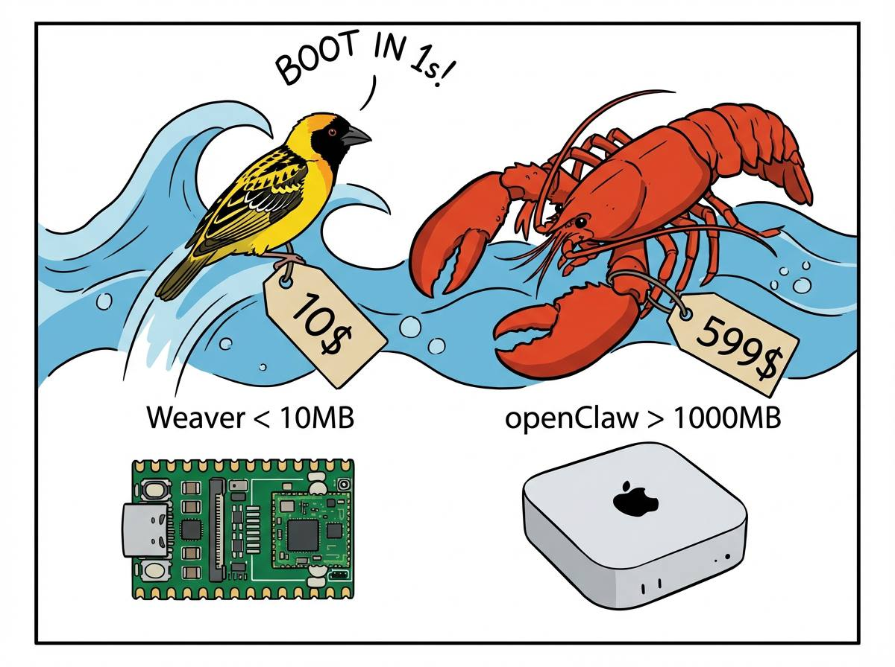

<div align="center">
  

  <h1>Weaver</h1>

  <p><strong>Ultra-efficient AI orchestration for high-density managed services.</strong></p>

  <p>
    
    
    
    <br>
    <a href="https://weaver.onl"></a>
    <a href="https://operator.onl"></a>
  </p>
</div>

---

## What is Weaver?

Weaver is a managed AI agent service designed for **high-density, low-latency orchestration**. Built from the ground up in Go, it enables the deployment of isolated, task-specific agents within Docker containers at scale.

- **Fast:** <1s boot time.
- **Light:** <10MB RAM footprint per agent.
- **Isolated:** Workspace-based directory isolation with strict Docker boundaries.
- **Universal:** Multi-channel gateway support (Telegram, Discord, Slack) with a unified tool protocol.

## Efficiency Comparison

<div align="center">
  
</div>

## Managed Infrastructure

Weaver powers the agentic layer of the **Operator Online** ecosystem. It is optimized for the `gemini-3-flash` model, balancing rapid tool execution with minimal resource consumption.

## Concepts

<div align="center">
  
  
</div>

## Quick Start

### Spawning an Agent

Weaver is designed to be spawned programmatically or via CLI.

```bash
docker run --rm \
  -v $(pwd)/workspaces/task-1:/root/.weaver/workspace \
  -e GEMINI_API_KEY=$GEMINI_API_KEY \
  operatoronline/weaver agent -m "Analyze the latest deployment logs"
```

### Running the Gateway

The central gateway dispatches messages from external channels to managed agents.

```bash
docker compose up -d weaver-gateway
```

## Configuration

Settings are managed via `config/config.json`. Key parameters:
- `workspace`: Path to persistent agent memory.
- `model`: Default LLM (recommended: `gemini-3-flash-preview`).
- `gateway`: Host and port for the central dispatcher.

---

&copy; 2026 **Operator Online**. Built for the next generation of agentic systems.
